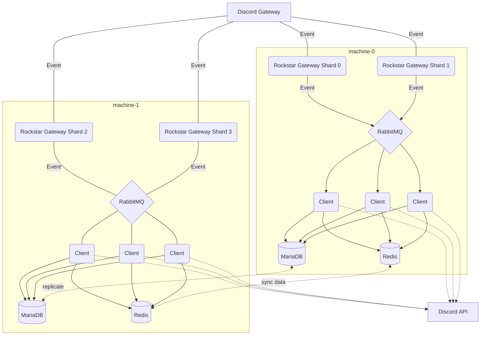

# rockstar
A WIP Discord Bot that puts Speed & Reliability first.

---

### Table of Contents
[[_TOC_]]

## Structure
Rockstar is organized like a monorepo, so everything is divided into it's own subproject.

#### Chart
| Directory | Purpose |
| ---       | ---     |
| `gateway` | Recieving Discord Events and putting them through RabbitMQ to be fed to Clients |
| `client`  | Recieving Events through RabbitMQ and acting on them, like processing Commands, Members, etc. |
| `handler` | The Client Command Handler. Parses a Command's Prefix, Command, and Arguments. |
| `frontend` | The Website |

#### Flow

